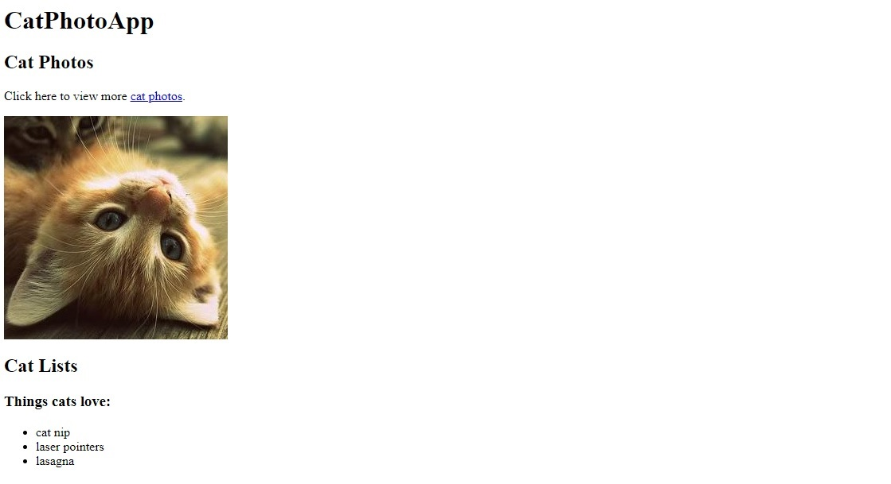

# 100 Days of Code 2022

On July 10, 2022, I took the challenge called #100DaysOfCode. This challenge aims to help me to become a better programmer by coding for at least an hour or two for straight 100 days. 

Before, I already had experience in developing a front-end design of a website using HTML, CSS, and Jquery. However, I have not yet explored the back-end part of a website -- which I am currently interested. 

This challenge paved a way for me to improve my skills as well as learn new technologies regarding full-stack web development. Join me as I document my progress for the next 100 days!

*Last updated: 7/11/2022*

## Day 1: HTML Basics [July 11, 2022]
On this day, I relearned the basics of HTML through freeCodeCamp. I chose the freeCodeCamp as my major resource (along with W3Schools) not just because it is free but also because it has a well-structured curriculum. **I started to built a Cat Photo App**. I did not finished it since I had something else to do by tomorrow morning. 

 