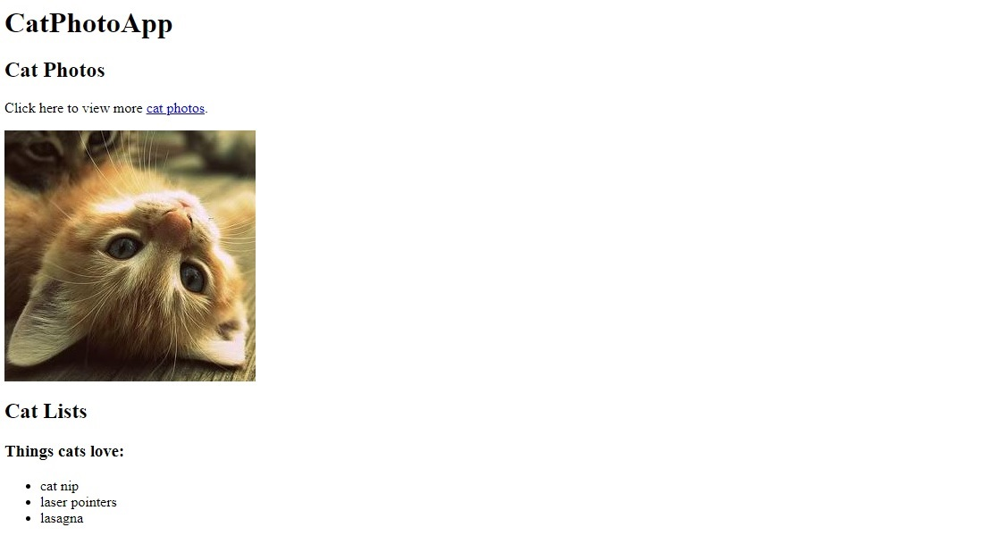
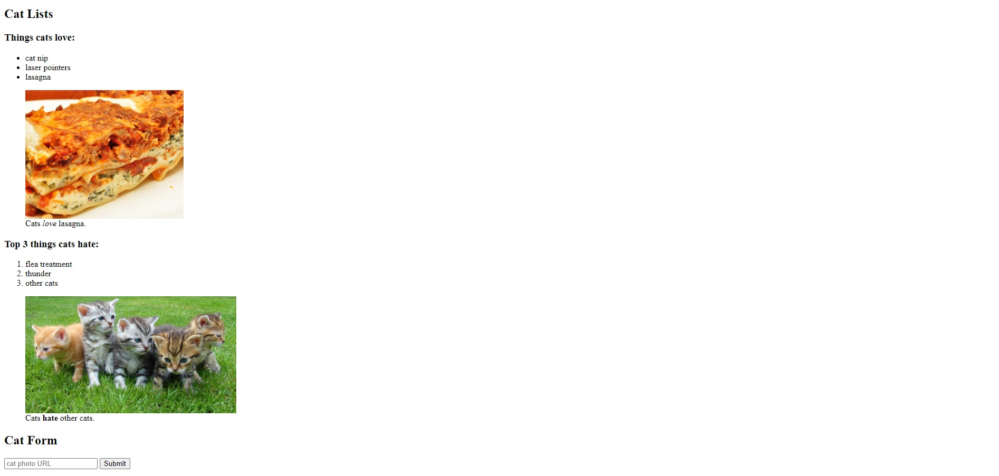

# 100 Days of Code 2022

On July 10, 2022, I took the challenge called #100DaysOfCode. This challenge aims to help me to become a better programmer by coding for at least an hour or two for straight 100 days. 

Before, I already had experience in developing a front-end design of a website using HTML, CSS, and Jquery. However, I have not yet explored the back-end part of a website -- which I am currently interested. 

This challenge paved a way for me to improve my skills as well as learn new technologies regarding full-stack web development. Join me as I document my progress for the next 100 days!

*Last updated: 7/15/2022*

## Day 1: HTML Basics [July 11, 2022]
On this day, I relearned the basics of HTML through freeCodeCamp. I chose the freeCodeCamp as my major resource (along with W3Schools) not just because it is free but also because it has a well-structured curriculum. **I started to built a Cat Photo App**. I did not finished it since I had something else to do by tomorrow morning. 

 

## Day 2: HTML Basics [July 14, 2022]
I was not able to continue working with the Cat photo app for two days because I had to attend some social gatherings. However, on this day, luckily I was able to continue re-learning the HTML. I worked on adding figures, figure captions, and adding forms as well as a button in the page. Below is my progress.

## Day 3: HTML Basics [July 21, 2022]
I stopped coding for days. This week was extremely busy. But now, I am back to studying and coding. Today, I finished the HTML Basics (in freeCodeCamp) and I finished doing my Cat Photo App. I am now currently studying different HTML basic syntax using W3Schools and learning some new **git** commands.  

